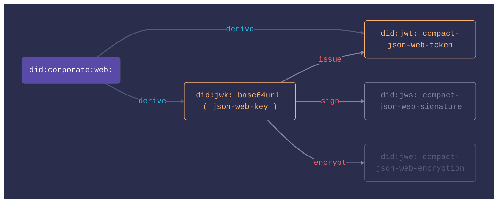

# did:transmute

[](https://github.com/transmute-industries/did-transmute/actions/workflows/ci.yml)


<!-- [](https://npmjs.org/package/@transmute/did-transmute) -->


#### [Questions? Contact Transmute](https://transmute.typeform.com/to/RshfIw?typeform-source=did-transmute)

This repository contains experimental implementations of various [DID Methods](https://www.w3.org/TR/did-core/).

A primary use case for this is "DID Method Projection", in which an existing identifier space such as 
all JWK or JWT, is projected into a Decentralizied Identifier space, such as `did:jwk:` or `did:jwt`.

This is accomplished by defining resolution and derefernecing for the DID URLs under the "projection method".

The prefixing might be removed as part of a standardization process.

For example: `did:corporate:example:123` might become `did:example:123` if doing so improves interoperability.

### Composition



## Usage

```bash
npm install '@transmute/did-transmute'
```

```ts
import transmute from '@transmute/did-transmute';
```

```js
const transmute = require('@transmute/did-transmute');
```

## did:jwk

### Generate

```ts
const actor1 = await transmute.did.jwk.exportable({
  alg: 'ES256',
});
// Use software isolation: 
// See https://developer.mozilla.org/en-US/docs/Web/API/SubtleCrypto/exportKey
const actor2 = await transmute.did.jwk.isolated({
  alg: 'ES256',
});
```

### Resolve & Dereference

```ts
const { did } = await transmute.did.jwk.exportable({
  alg: 'ES256',
});
const didDocument = await transmute.did.jwk.resolve({ did });
// See https://www.w3.org/TR/did-core/#verification-relationships
const { publicKeyJwk } = await transmute.did.jwk.dereference({
  didUrl: `${did}#0`,
  resolver: transmute.did.jwk.resolve,
});
```

### Sign & Verify

```ts
const { key: { privateKeyJwk, publicKeyJwk } } = await transmute.did.jwk.exportable({
  alg: transmute.did.jws.alg.ES256,
});
const jws = await transmute.sign({
  privateKey: privateKeyJwk,
  protectedHeader: {
    alg: privateKeyJwk.alg,
  },
  payload: new TextEncoder().encode("It’s a dangerous business, Frodo, going out your door. 🧠💎"),
});
const v = await transmute.verify({
  jws,
  publicKey: publicKeyJwk,
});
```

### Encrypt & Decrypt

```ts
const { key: { privateKeyJwk, publicKeyJwk } } = await transmute.did.jwk.exportable({
  alg: transmute.did.jwe.alg.ECDH_ES_A256KW,
});
const jwe = await transmute.encrypt({
  publicKey: publicKeyJwk,
  plaintext: new TextEncoder().encode("It’s a dangerous business, Frodo, going out your door. 🧠💎"),
  protectedHeader: {
    alg: publicKeyJwk.alg,
    enc: transmute.did.jwe.enc.A256GCM,
  },
});
const v = await transmute.decrypt({
  jwe,
  privateKey: privateKeyJwk,
});
```

## Develop

```bash
npm i
npm t
npm run lint
npm run build
```