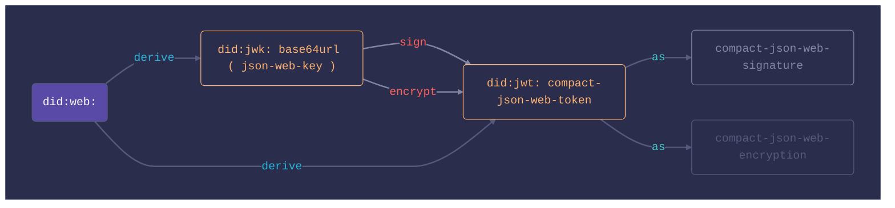
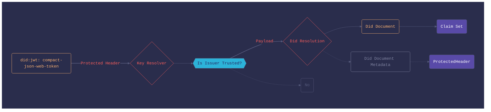

# did:transmute

[](https://github.com/transmute-industries/did-transmute/actions/workflows/ci.yml)


<!-- [](https://npmjs.org/package/@transmute/did-transmute) -->


#### [Questions? Contact Transmute](https://transmute.typeform.com/to/RshfIw?typeform-source=did-transmute)

This repository contains experimental implementations of various [DID Methods](https://www.w3.org/TR/did-core/).

A primary use case for this is "DID Method Projection", in which an existing identifier space such as 
all JWK or JWT, is projected into a Decentralizied Identifier space, such as `did:jwk:` or `did:jwt`.

This is accomplished by defining resolution and dereferencing for the DID URLs under the "projection method".

### Composition



## Usage

```bash
npm install '@transmute/did-transmute'
```

```ts
import transmute from '@transmute/did-transmute';
```

```js
const transmute = require('@transmute/did-transmute');
```

## did:jwk

### Generate

```ts
const actor1 = await transmute.did.jwk.exportable({
  alg: 'ES256',
});
// Use software isolation: 
// See https://developer.mozilla.org/en-US/docs/Web/API/SubtleCrypto/exportKey
const actor2 = await transmute.did.jwk.isolated({
  alg: 'ES256',
});
```

### Resolve & Dereference

```ts
const { 
  did 
} = await transmute.did.jwk.exportable({
  alg: 'ES256',
});
const didDocument = await transmute.did.jwk.resolve({ 
  id: did,
  documentLoader: transmute.did.jwk.documentLoader
});
// See https://www.w3.org/TR/did-core/#verification-relationships
const { publicKeyJwk } = await transmute.did.jwk.dereference({
  id: `${did}#0`,
  documentLoader: transmute.did.jwk.documentLoader
});
```

### Sign & Verify

```ts
const { 
  key: { privateKey, publicKey } 
} = await transmute.did.jwk.exportable({
  alg: transmute.jose.alg.ES256,
});
const jws = await transmute.sign({
  privateKey: privateKey,
  protectedHeader: {
    alg: privateKey.alg,
  },
  payload: new TextEncoder().encode("It’s a dangerous business, Frodo, going out your door. 🧠💎"),
});
const v = await transmute.verify({
  jws,
  publicKey: publicKey,
});
```

### Encrypt & Decrypt

```ts
const { 
  key: { privateKey, publicKey } 
} = await transmute.did.jwk.exportable({
  alg: transmute.jose.alg.ECDH_ES_A256KW,
});
const jwe = await transmute.encrypt({
  publicKey: publicKey,
  plaintext: new TextEncoder().encode("It’s a dangerous business, Frodo, going out your door. 🧠💎"),
  protectedHeader: {
    alg: publicKey.alg,
    enc: transmute.jose.enc.A256GCM,
  },
});
const v = await transmute.decrypt({
  jwe,
  privateKey: privateKey,
});
```

## did:jwt

This method is very 🚧 experimental 🏗️.



There are several different ways to "trust" a JSON Web Token issuer, based `exclusively` or the `header` and `verify` or `decrypt` operations.

### Embedding keys

Using [jwk](https://www.rfc-editor.org/rfc/rfc7515.html#section-4.1.3) and [x5c](https://www.rfc-editor.org/rfc/rfc7515.html#section-4.1.6).

> Embedding the key within the token is a straightforward way to enable key distribution. To ensure the security of this mechanism, the consumer of the JWT needs to restrict which keys it accepts. Failure to do so allows an attacker to generate tokens signed with a malicious private key. An overly permitting consumer would merely use the embedded public key to verify the signature, which will be valid. To avoid such issues, the consumer needs to match the key used against a set of explicitly whitelisted keys. In case the key comes in the form of an X509 certificate, the consumer can use the certificate information to verify the authenticity.

- [Source](https://www.pingidentity.com/en/resources/blog/post/jwt-security-nobody-talks-about.html)


When `jwk` is present in the `Protected Header` of a `JWT`, a custom `did:jwk` resoler will be used as the the `allow-list`.

A `null` resolution is treated as a `deny` operation.

See also [panva/jose](https://github.com/panva/jose/blob/HEAD/docs/functions/jwk_embedded.EmbeddedJWK.md#readme).

### Distributing keys

Using [jku](https://www.rfc-editor.org/rfc/rfc7515.html#section-4.1.2) and [x5u](https://www.rfc-editor.org/rfc/rfc7515.html#section-4.1.5).

## TODO

See [RFC7515](https://www.rfc-editor.org/rfc/rfc7515.html)

#### Proof of Possession

## TODO

See [RFC7800](https://www.rfc-editor.org/rfc/rfc7800.html#section-3)

### Using OpenID Connect Discovery

🚧 Experimental 🏗️.




```mermaid
%%{
  init: {
    'theme': 'base',
    'themeVariables': {
      'primaryColor': '#2a2d4c',
      'primaryTextColor': '#565a7c',
      'nodeBorder': '#565a7c',
      'edgeLabelBackground': '#2a2d4c',
      'clusterBkg': '#2a2d4c',
      'clusterBorder': '#2a2d4c',
      'lineColor': '#565a7c',
      'fontFamily': 'monospace',
      'darkmode': true
    }
  }
}%%
%% Support https://transmute.industries

flowchart LR
subgraph 0 [Open ID Connect 'DID Method']
direction LR
ProtectedHeader("Protected Header")
ProtectedClaimSet("Protected Claim Set")
DecodedVerificationMethodComponents("{ iss, kid }")
WellKnownConfig(".well-known/openid-configuration")
WellKnownJwks(".well-known/jwks.json")
DidDocument("DID Document")

ProtectedHeader -.-> DecodedVerificationMethodComponents
ProtectedClaimSet -.-> DecodedVerificationMethodComponents
DecodedVerificationMethodComponents -.-> WellKnownConfig
WellKnownConfig -.-> WellKnownJwks
WellKnownJwks -.-> DidDocument

VerificationMethod("{{iss}}#{{kid}}")
DecodedVerificationMethodComponents -.-> VerificationMethod

DidDocument -.-> publicKey
publicKey("{ publicKeyJwk }")
VerificationMethod -.-> publicKey

class ProtectedHeader,ProtectedClaimSet,publicKey PurpleNode
class DecodedVerificationMethodComponents,WellKnownConfig,WellKnownJwks RedNode
class DidDocument,VerificationMethod TealNode

classDef PurpleNode color:#fff, fill:#594aa8, stroke:#27225b, stroke-width:1px;
classDef RedNode color:#ff605d, stroke:#ff605d, stroke-width:1px;
classDef OrangeNode color:#fcb373, stroke:#fcb373, stroke-width:1px;
classDef GreyNode fill:#f5f7fd, stroke:#f5f7fd, stroke-width:1px;
classDef WhiteNode color:#fff, stroke:#fff, stroke-width:1px;
classDef DarkPurpleNode color:#f5f7fd, fill:#27225b, stroke:#f5f7fd, stroke-width:1px;
classDef TealNode color:#48caca, stroke:#48caca, stroke-width:1px;
classDef AquaNode color:#2cb3d9, stroke:#2cb3d9, stroke-width:1px;
end
```

#### Example DID Document

```json
{
  "id": "{{iss}}",
  "verificationMethod":[{
    "id": "#{{kid}}",
    "type": "JsonWebKey",
    "controller": "{{iss}}",
    "publicKey":{
      "kid": "urn:ietf:params:oauth:jwk-thumbprint:sha-256:AXRYM9BnKWZj6c84ykLX6D-fE9FRV2_f3pRDwcJGSU0",
      "kty": "OKP",
      "crv": "Ed25519",
      "alg": "EdDSA",
      "x": "dh2c41edqveCxEzw3OVjtAmdcJPwe4lAg2fJ10rsZk0",
    }
  }],
  "assertionMethod": ["#{{kid}}"]
}
```

See [openid-connect-discovery](https://openid.net/specs/openid-connect-discovery-1_0-21.html)

### Verifiable Credential's JSON Web Token Profile

This approach relies on the `resolver` to act as an allow list for `absolute did urls`, constructed from `kid` or a combination of `kid` and `iss`.

For example, a `protectedHeader` might look like:

```json
{
  "alg": "ES256",
  "iss": "did:example:123",
  "kid": "#key-4"
}
```

or 

```json
{
  "alg": "ES256",
  "kid": "did:example:123#key-4"
}
```

This header will be used to dereference a `verificationMethod` which is expected to contain a `publicKey`.

For example:

```json
{
  "id": "#key-4",
  "type": "JsonWebKey",
  "controller": "did:example:123",
  "publicKeyJwk": {
    "kid": "urn:ietf:params:oauth:jwk-thumbprint:sha-256:AXRYM9BnKWZj6c84ykLX6D-fE9FRV2_f3pRDwcJGSU0",
    "kty": "OKP",
    "crv": "Ed25519",
    "alg": "EdDSA",
    "x": "dh2c41edqveCxEzw3OVjtAmdcJPwe4lAg2fJ10rsZk0",
  }
}
```

or

```json
{
  "id": "did:example:123#urn:ietf:params:oauth:jwk-thumbprint:sha-256:AXRYM9BnKWZj6c84ykLX6D-fE9FRV2_f3pRDwcJGSU0",
  "type": "JsonWebKey",
  "controller": "did:example:123",
  "publicKeyJwk": {
    "kid": "urn:ietf:params:oauth:jwk-thumbprint:sha-256:AXRYM9BnKWZj6c84ykLX6D-fE9FRV2_f3pRDwcJGSU0",
    "kty": "OKP",
    "crv": "Ed25519",
    "alg": "EdDSA",
    "x": "dh2c41edqveCxEzw3OVjtAmdcJPwe4lAg2fJ10rsZk0",
  }
}
```

See [jwt-vc-presentation-profile](https://identity.foundation/jwt-vc-presentation-profile/)

### Sign

```ts
const issuer = await transmute.did.jwk.exportable({
    alg: alg.ES256,
  });
const subject = await transmute.did.jwt.sign({
  issuer: "did:example:123",
  audience: "did:example:456",
  protectedHeader: {
    alg: issuer.key.publicKey.alg,
  },
  claimSet: {
    "urn:example:claim": true,
  },
  privateKey: issuer.key.privateKey,
});
```

### Encrypt

```ts
const issuer = await transmute.did.jwk.exportable({
  alg: alg.ECDH_ES_A256KW,
});
const subject = await transmute.did.jwt.encrypt({
  issuer: "did:example:123",
  protectedHeader: {
    alg: issuer.key.publicKey.alg,
    iss: "did:example:123",
    kid: "#0",
    enc: transmute.jose.enc.A256GCM,
  },
  claimSet: {
    service: [
      {
        id: "#dwn",
        type: "DecentralizedWebNode",
        serviceEndpoint: {
          nodes: ["https://dwn.example.com", "https://example.org/dwn"],
        },
      },
    ],
  },
  publicKey: issuer.key.publicKey,
});
```

### Resolve

```ts
const didDocument = await transmute.did.jwt.resolve({
  id: subject.did,
  privateKeyLoader: async (id: string) => {
    if (id.startsWith("did:example:123")) {
      return issuer.key.privateKey;
    }
    throw new Error("privateKeyLoader does not support identifier: " + id);
  },
  profiles: ["encrypted-jwt"],
});
```

### Dereference

```ts
type DwnService = {
  id: "#dwn";
  type: "DecentralizedWebNode";
  serviceEndpoint: {
    nodes: ["https://dwn.example.com", "https://example.org/dwn"];
  };
};
const service = await transmute.did.jwt.dereference<DwnService>({
  id: `${subject.did}#dwn`,
  privateKeyLoader: async (id: string) => {
    if (id.startsWith("did:example:123")) {
      return issuer.key.privateKey;
    }
    throw new Error("privateKeyLoader does not support identifier: " + id);
  },
  profiles: ["encrypted-jwt"],
});
```

## did:web

This method is very 🚧 experimental 🏗️.

### Generate

```ts
 const { did, didDocument, key } = await transmute.did.web.exportable({
  url: "https://id.gs1.transmute.example/01/9506000134352",
  alg: transmute.jose.alg.ES256,
  documentLoader: transmute.did.jwk.documentLoader,
});
```

### From Private Key

```ts
const { 
  key: {privateKey} 
} = await transmute.did.jwk.exportable({
  alg: 'ES256',
});
const issuer = await transmute.did.web.fromPrivateKey({
  url: "https://id.gs1.transmute.example/01/9506000134352",
  privateKey: privateKey,
});
```

### From Dids

```ts
const { 
  did
} = await transmute.did.jwk.exportable({
  alg: 'ES256',
});
const issuer = await transmute.did.web.fromDids({
  url: "https://id.gs1.transmute.example/01/9506000134352",
  dids: [did],
  documentLoader: transmute.did.jwk.documentLoader,
});
```

### Resolve

```ts
const { 
  key: { privateKey } 
} = await transmute.did.jwk.exportable({
  alg: 'ES256',
});
const issuer = await transmute.did.web.fromPrivateKey({
  url: "https://id.gs1.transmute.example/01/9506000134352",
  privateKey: privateKey,
});
const didDocument = await transmute.did.web.resolve({
  id: issuer.did,
  documentLoader: async (iri: string) => {
    // for test purposes.
    if (iri === "https://id.gs1.transmute.example/01/9506000134352/did.json") {
      return { document: issuer.didDocument };
    }
    throw new Error("Unsupported IRI " + iri);
  },
});
// didDocument.id = "did:web:id.gs1.transmute.example:01:9506000134352"
```

### Dereference

```ts
const issuer = await transmute.did.web.fromPrivateKey({
  url: "https://id.gs1.transmute.example/01/9506000134352",
  privateKey: {
    kid: "urn:ietf:params:oauth:jwk-thumbprint:sha-256:a9EEmV5OPmFQlAVU2EDuKB3cp5JpirRwnD12UdHc91Q",
    kty: "EC",
    crv: "P-256",
    alg: "ES256",
    x: "D1ygYPasDI88CrYAF_Ga_4aXEhp5fWetEXzyitdt1K8",
    y: "dkxXWzis0tQQIctZRzSvf6tdeITCLXim8HgTUhMOTrg",
    d: "RWgQ966yzek12KSlDJ-hmlqckRUhZzKDqJeM_QdbT-E",
  },
});
const verificationMethod = await transmute.did.web.dereference({
  id: `${issuer.did}#a9EEmV5OPmFQlAVU2EDuKB3cp5JpirRwnD12UdHc91Q`,
  documentLoader: async (iri: string) => {
    // for test purposes.
    if (
      iri === "https://id.gs1.transmute.example/01/9506000134352/did.json"
    ) {
      return { document: issuer.didDocument };
    }
    throw new Error("Unsupported IRI " + iri);
  },
});
const v = await transmute.verify({
  jws,
  publicKey: verificationMethod.publicKeyJwk,
});
```

## Develop

```bash
npm i
npm t
npm run lint
npm run build
```